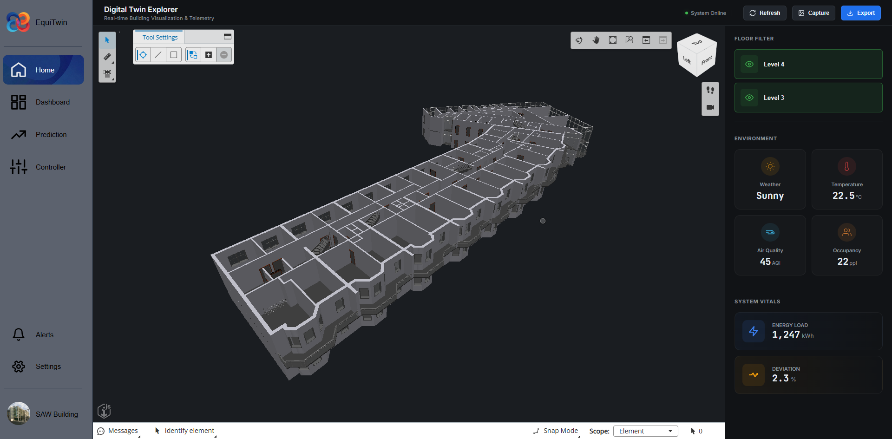
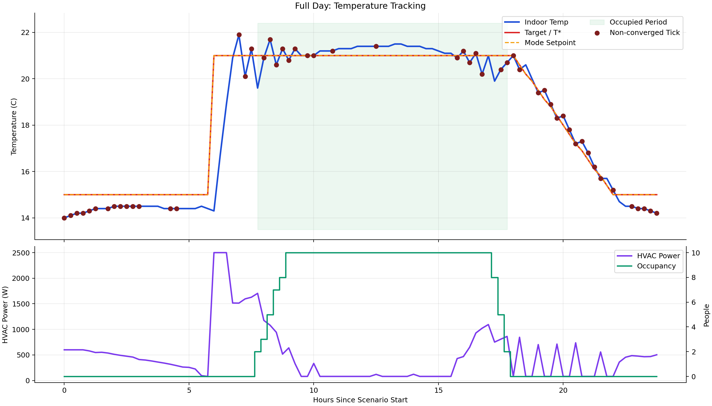

# EquiTwin

*Honours Individual Project - Yiğit Sayar · University of Glasgow*

Supervised by Dr. Awais Shah and Harsh Vivek Shah

Most building control systems react for the immediate state. EquiTwin takes the reaction to a wider horizon (via Multi-Layered Model Prodictive Controller). It is trained by the building's data. It learns its patterns, and tries to act ahead of time.

As a full-stack, EquiTwin combines a live 3D model of the building, a historical data dashboard, short and long-term forecasting, and a model predictive controller that runs closed-loop simulations to plan heating and ventilation decisions before they are immediately optimising energy and comfort for the user's liking.

*For setup instructions, see [setup.md](setup.md)*
